# Операционные системы UNIX/Linux (Базовый).

## Part 1. Установка ОС

**== Задание ==**

##### Установи **Ubuntu 20.04 Server LTS** без графического интерфейса. (Используем программу для виртуализации - VirtualBox)

- Графический интерфейс должен отсутствовать.

- Узнай версию Ubuntu, выполнив команду \
`cat /etc/issue.`

## Создание пользователя

**== Задание ==**

##### Создай пользователя, отличного от созданного при установке. Пользователь должен быть добавлен в группу `adm`.

- Вставь скриншот вызова команды для создания пользователя.

используем команду **useradd**

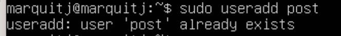

- Новый пользователь должен быть в выводе команды 

`cat /etc/passwd`
- Вставь скриншот с выводом команды.

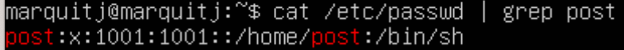

- Добавляем в группу adm

## Part 3. Настройка сети ОС

**== Задание ==**

##### Задай название машины вида user-1.

- Производиться по команде **hostnamectl** 

- Проверка

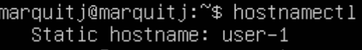

##### Установи временную зону, соответствующую твоему текущему местоположению.  

- Устанавливаем зону с помощью двнной команды:

- Проверка команды:

##### Используя консольную команду, получи ip адрес устройства, на котором ты работаешь, от DHCP сервера. 
- Выводим данные с помощью команды **ifonfig** 

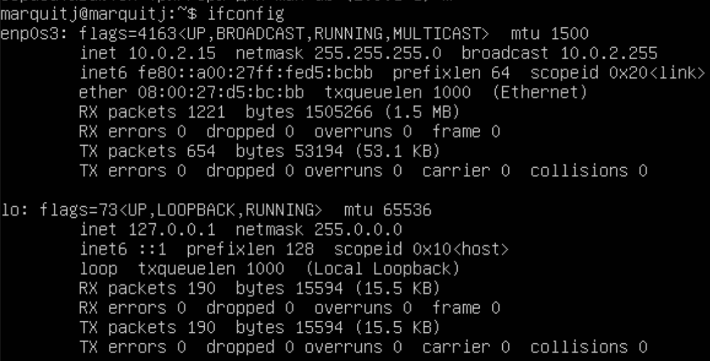

- Выводим IP адрес устройства от DHCP сервера с помощью команды **ip addr show**:

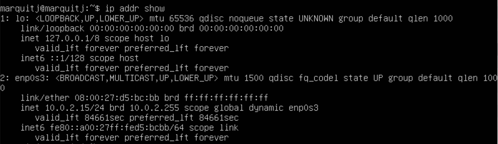

##### Определи и выведи на экран внешний ip-адрес шлюза (ip) и внутренний IP-адрес шлюза, он же ip-адрес по умолчанию (gw). 

- Определяем по команде ip rout:

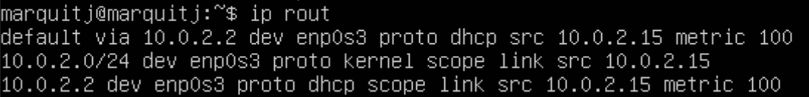

##### Задай статичные (заданные вручную, а не полученные от DHCP сервера) настройки ip, gw, dns (используй публичный DNS серверы, например 1.1.1.1 или 8.8.8.8).  
 - Создаем документ в файле **01-network-manager-all.yaml** с помиощью комнды sudo nano /etc/netplan/01-network-manager-all.yaml

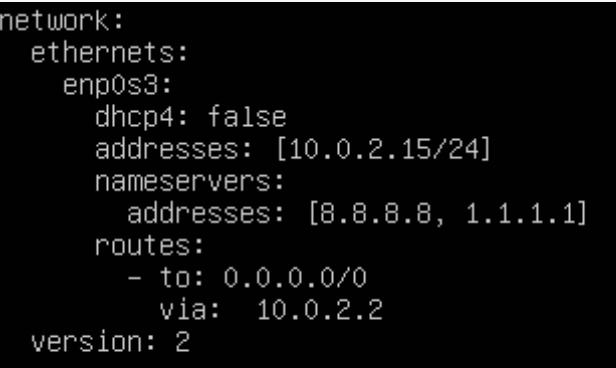

- затем применяем команду **sudo netplan apply** тем самым загружаем настройки

##### Перезагрузи виртуальную машину. Убедись, что статичные сетевые настройки (ip, gw, dns) соответствуют заданным в предыдущем пункте.  

- Для перезагрузки используем команду **reboot**

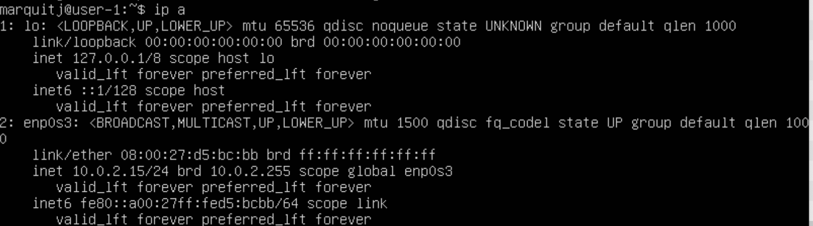

- Успешно пропингуй удаленные хосты 1.1.1.1 и ya.ru и вставь в отчёт скрин с выводом команды. В выводе команды должна быть фраза «0% packet loss».

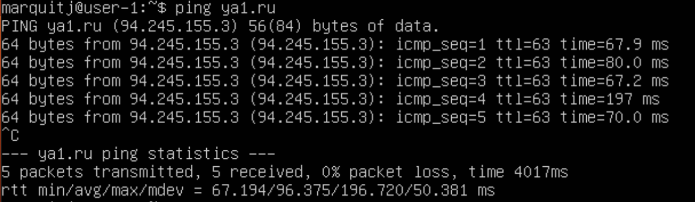

## Part 4. Обновление ОС

**== Задание ==**

##### Обнови системные пакеты до последней на момент выполнения задания версии.  

- После обновления системных пакетов, если ввести команду обновления повторно, должно появиться сообщение, что обновления отсутствуют;
- Вставь скриншот с этим сообщением в отчёт.

- Используется команда **sudo apt update**

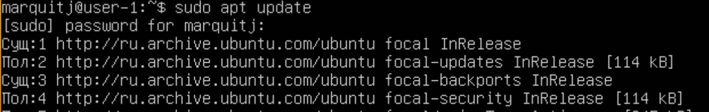

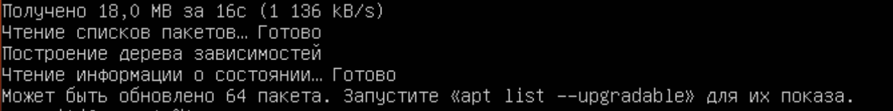

- Используется команда **sudo apt upgrade**

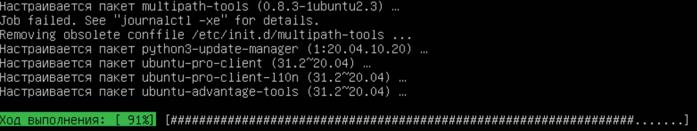

## Part 5. Использование команды **sudo**

**== Задание ==**

##### Разреши пользователю, созданному в [Part 2](#part-2-создание-пользователя),выполнять команду sudo.

- В отчёте объясни *истинное* назначение команды sudo (про то, что это слово - «волшебное», писать не стоит);  
- Поменяй hostname ОС от имени пользователя, созданного в пункте [Part 2](#part-2-создание-пользователя) (используя sudo);
---
Истинное значение команды sudo:
- Sudo - команда для выполнения задач с правами суперпользователя в Ubuntu.
- Позволяет устанавливать/удалять ПО, изменять системные настройки.
- Используется для временного доступа к привилегиям root без необходимости входа в систему как root.
- Способствует безопасности системы, избегая постоянного использования учетной записи суперпользователя.
---

Поменяй hostname ОС от имени пользователя, созданного в пункте [Part 2](#part-2-создание-пользователя) (используя sudo):

- Используем команду **su post** для того чтобы переключиться на user-1;

- Командой **sudo hosnamectl set-hostname** меняем имя на ironman: 

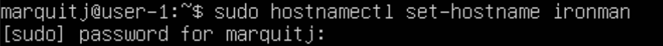

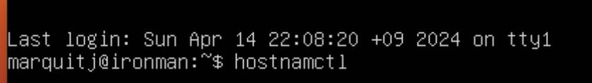

## Part 6. Установка и настройка службы времени

`-` Хоть у нас сейчас и стоит правильное время, оно может быть таким не всегда. Чтобы не настраивать его каждый раз самим, существуют службы синхронизации времени.

**== Задание ==**

##### Настрой службу автоматической синхронизации времени.  

- Выведи время часового пояса, в котором ты сейчас находишься.
Используется команда **sudo timedatectl show**

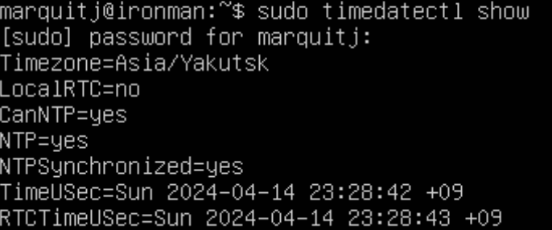

- Вывод следующей команды должен содержать `NTPSynchronized=yes`: \
  `timedatectl show`

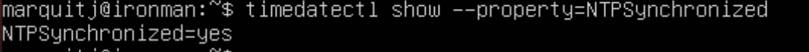

## Part 7. Установка и использование текстовых редакторов 

**== Задание ==**

##### Установи текстовые редакторы **VIM** (+ любые два по желанию **NANO**, **MCEDIT**, **JOE** и т.д.)  
##### Используя каждый из трех выбранных редакторов, создай файл *test_X.txt*, где X -- название редактора, в котором создан файл. Напиши в нём свой никнейм, закрой файл с сохранением изменений.  

- Загружаем текстовые редакторы с помощью команды **sudo apt install**

 - Загрузка Vim: 
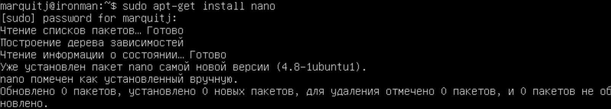

- Загрузка Nano: 
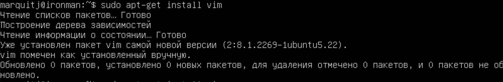

- Загрузка Joe: 
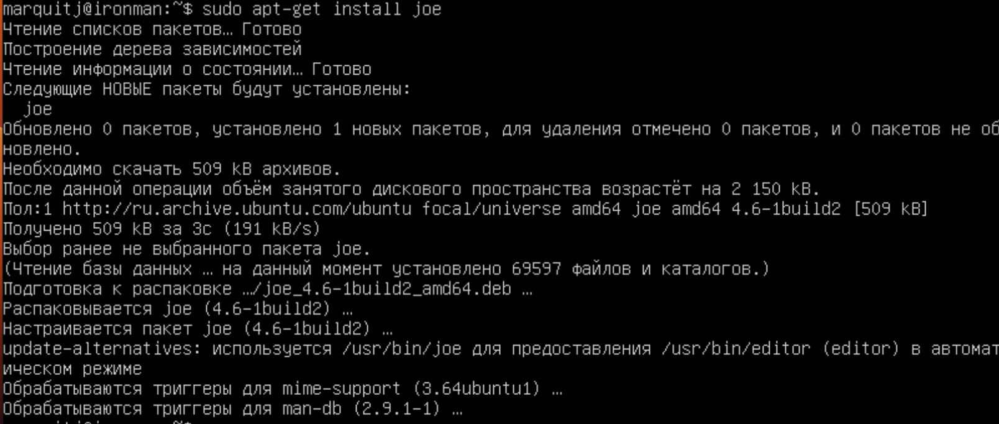
- В отчёт вставь скриншоты:
  - Из каждого редактора с содержимым файла перед закрытием;
- Создаем в vim:
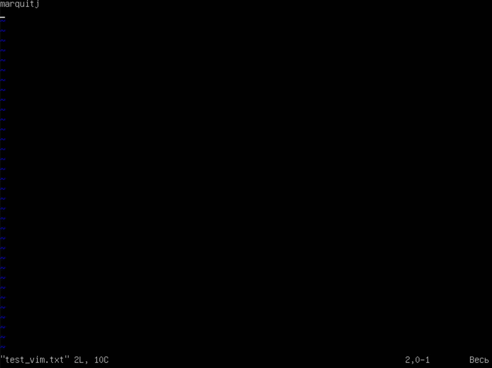

 - Создаем в nano:
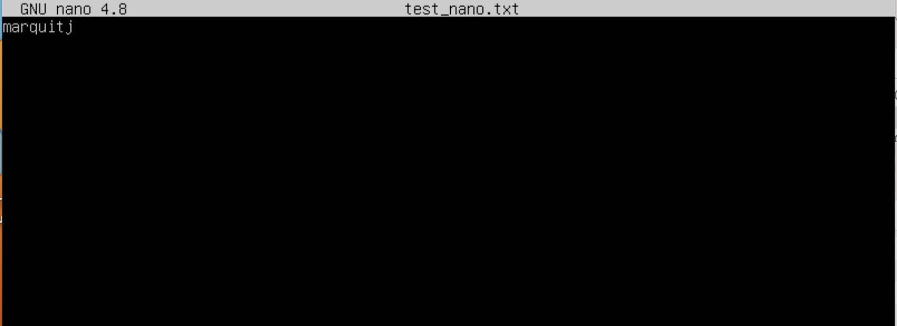

 - Создаем в joe:
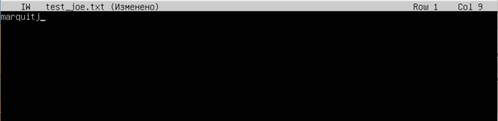  

- В отчёте укажи, что сделал для выхода с сохранением изменений.

-  В vim использовала кнопку esc, затем используется комбинация ":wq";

- В nano используется комбинация Ctrl+O для сохранения, затем Ctrl+X для выхода;

- В joe используется комбинация Ctrl+K и за тем O для созранения и Ctrl+K, затем X для выхода.

##### Используя каждый из трех выбранных редакторов, открой файл на редактирование, отредактируй файл, заменив никнейм на строку «21 School 21», закрой файл без сохранения изменений.
- В отчёт вставь скриншоты:
    - Из каждого редактора с содержимым файла после редактирования;

  - Создаем в vim:
    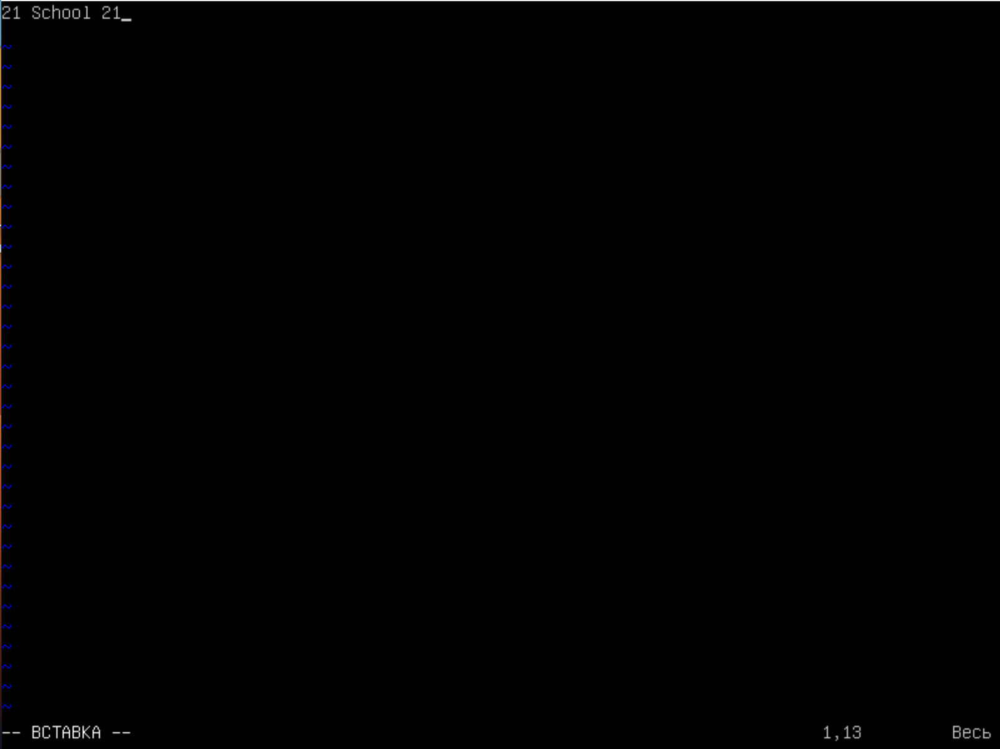
  
  - Создаем в nano:
    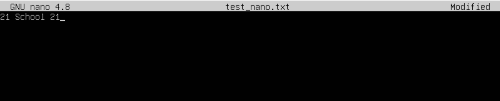    
  
  - Создаем в joe:
    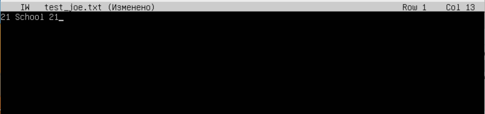  
  

- В vim использовала кнопку esc, затем используется комбинация ":q!";

- В nano используется Ctrl+X для выхода. При вопросе о необходимости сохранения нажимаем - N.;

- В joe используется комбинация Ctrl+K, затем X для выхода. При вопросе о необходимости сохранения нажимаем - N.

##### Используя каждый из трех выбранных редакторов, отредактируй файл ещё раз (по аналогии с предыдущим пунктом), а затем освой функции поиска по содержимому файла (слово) и замены слова на любое другое.

  - Создаем в vim и осуществляем поиск:
    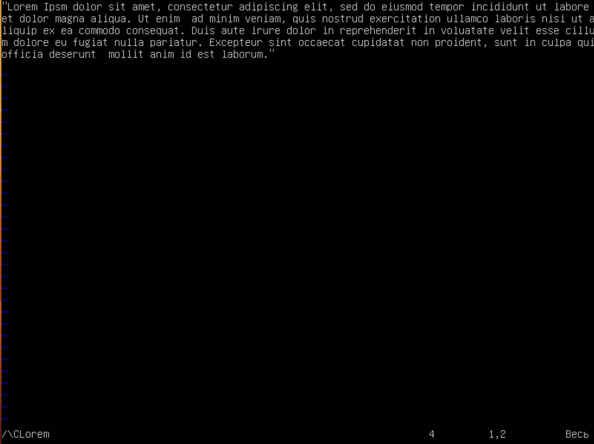
  
  - Создаем в nano и осуществляем поиск:
    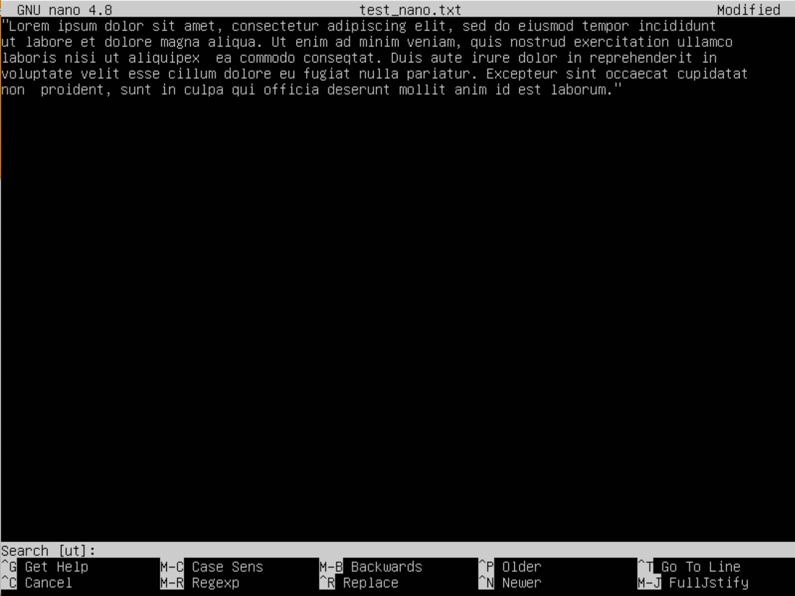    
  
  - Создаем в joe и осуществляем поиск:
    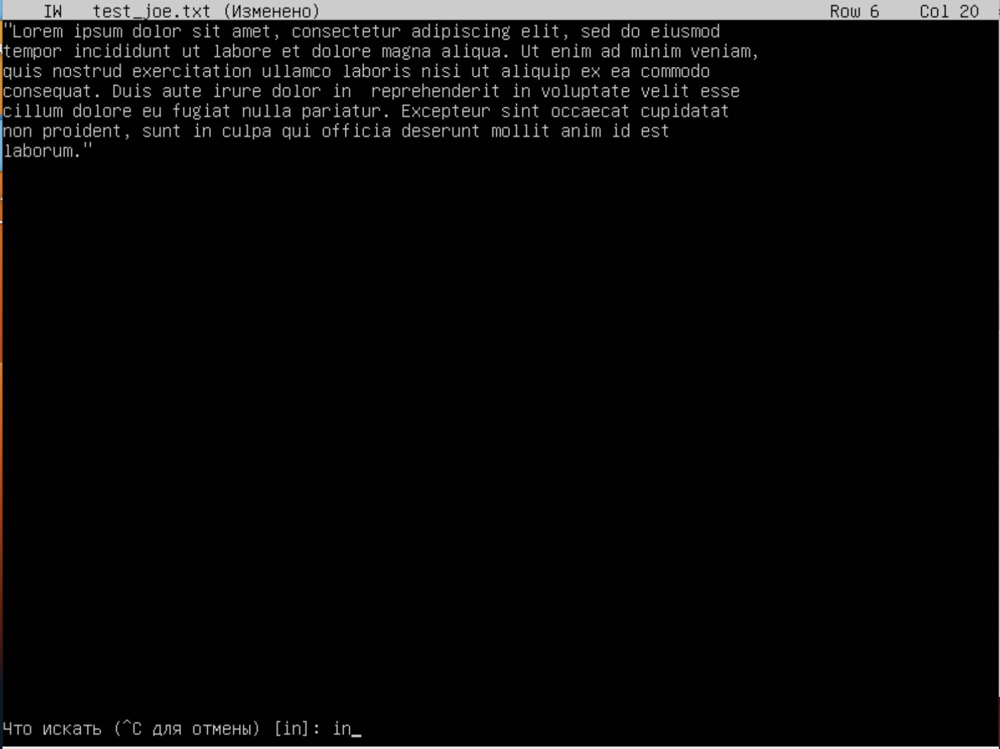  
  

  - Поиск производится сочетанием:

    - vim:

      - Нажимаем esc и затем сочетание клавишь /\C%слово%;

    - nano:

      - Сочетание Ctrl+W и вводим текст;

    - joe:

      - Сочетание Ctrl+K, затем ввод слова потом Enter и затем B.

## Part 8. Установка и базовая настройка сервиса **SSHD**

**== Задание ==**

##### Установи службу SSHd.  

  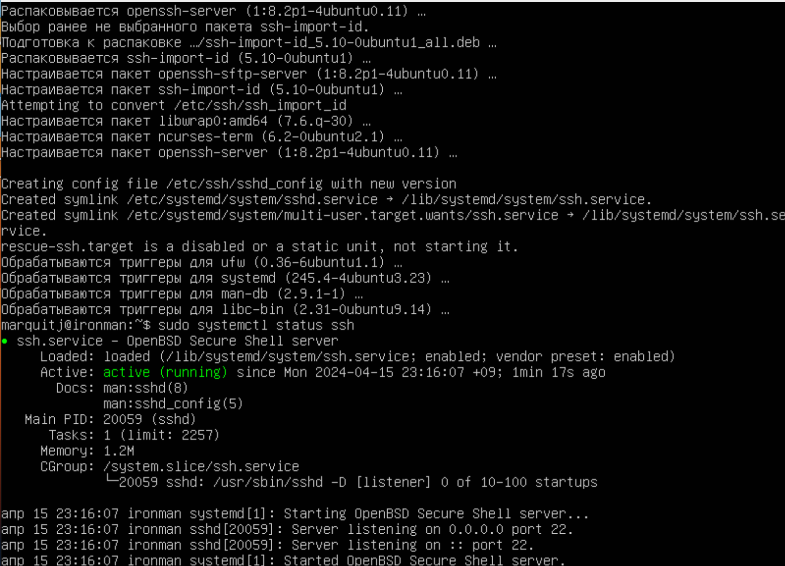 
##### Добавь автостарт службы при загрузке системы. 

 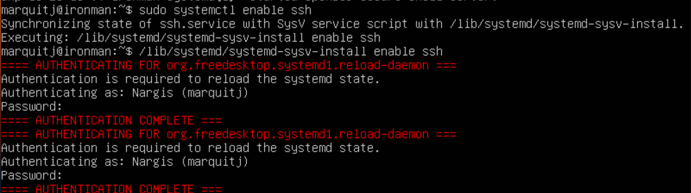  
##### Перенастрой службу SSHd на порт 2022.  

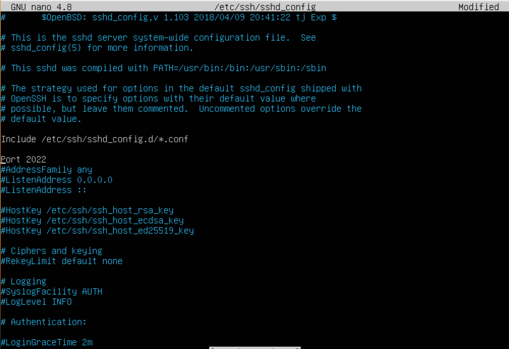  

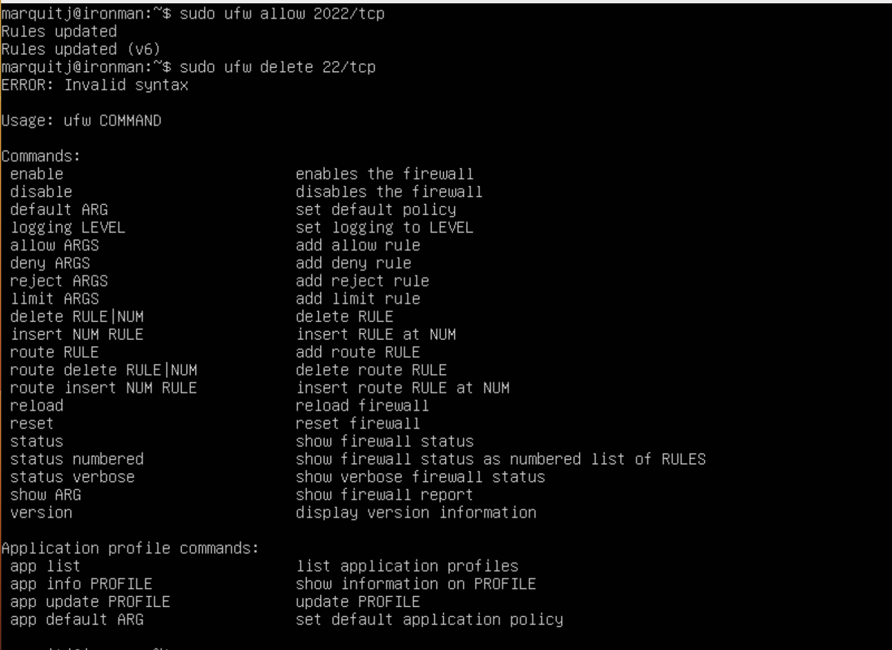  
##### Используя команду ps, покажи наличие процесса sshd. Для этого к команде нужно подобрать ключи.

- Команда ps в UNIX-подобных операционных системах используется для отображения информации о работающих процессах. Чтобы найти процесс sshd с помощью команды ps, можно использовать различные ключи. Вот несколько примеров:
  - Используйте команду ps aux для отображения всех работающих процессов, а затем фильтруйте вывод с помощью grep:
 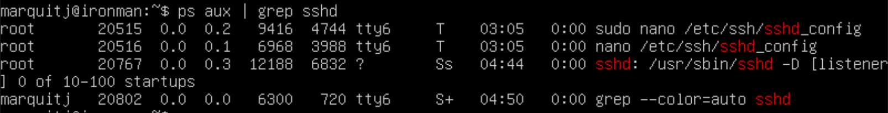  
    - aux: Комбинация трех флагов (a, u, x), которая обеспечивает подробный вывод, включающий в себя пользователя, который запустил процесс, использование CPU и памяти, и другие детали.

      - a: Показывает процессы всех пользователей.
      - u: Показывает процесс в пользовательском формате, который включает в себя имя пользователя, использование CPU и памяти, время запуска и команду.
      - x: Показывает процессы, не связанные с терминалом.

- Используйте ключ -C с командой ps для поиска процессов по имени команды:
    - 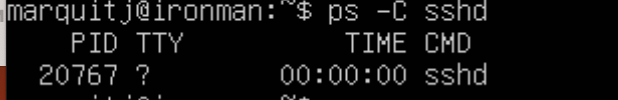
      - C <имя_процесса>: Этот флаг используется для фильтрации процессов по имени команды.  ps -C sshd покажет только процессы с именем команды sshd.

- Используйте ключи -e для отображения всех процессов и grep для фильтрации:

  - 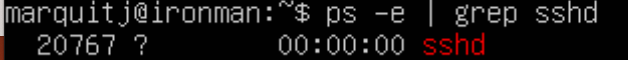
    - -e или -A: Эти флаги используются для отображения информации обо всех процессах в системе. Флаг -e является синонимом -A.

- Используйте ключи -ef для более подробного вывода всех процессов с полным форматированием и grep для фильтрации:

    - 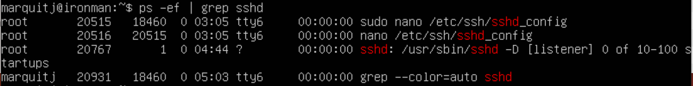

      - -f: Этот флаг обеспечивает "полный" формат вывода, который включает в себя UID (идентификатор пользователя), PID (идентификатор процесса), PPID (идентификатор родительского процесса), и другую информацию о каждом процессе.

- Используйте ключ -u для отображения процессов определённого пользователя (например, root), который обычно запускает sshd:

  - 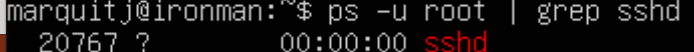

    - u: Показывает процесс в пользовательском формате, который включает в себя имя пользователя, использование CPU и памяти, время запуска и команду.

##### Перезагрузи систему.
- 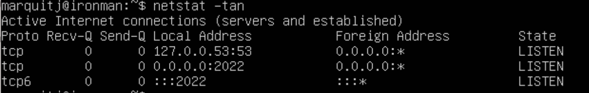

- В отчёте объясни значение ключей -tan, значение каждого столбца вывода, значение 0.0.0.0.

- Флаги означают следующее:

    - -t означает отображать только TCP соединения.
    - -a означает отображать все соединения и прослушиваемые порты.
    - -n означает отображать адреса в числовом формате, а не пытаться определять имена хостов.

- Значение 0.0.0.0. - Эта строка означает, что на вашем сервере есть процесс, который прослушивает входящие TCP-соединения на порту 2022 на всех интерфейсах (0.0.0.0).

## Part 9. Установка и использование утилит **top**, **htop**

`-` Если бы меня спросили, что полезного делают утилиты **top** и **htop**, я бы ответил одним словом - всё.

**== Задание ==**

##### Установи и запусти утилиты top и htop.  

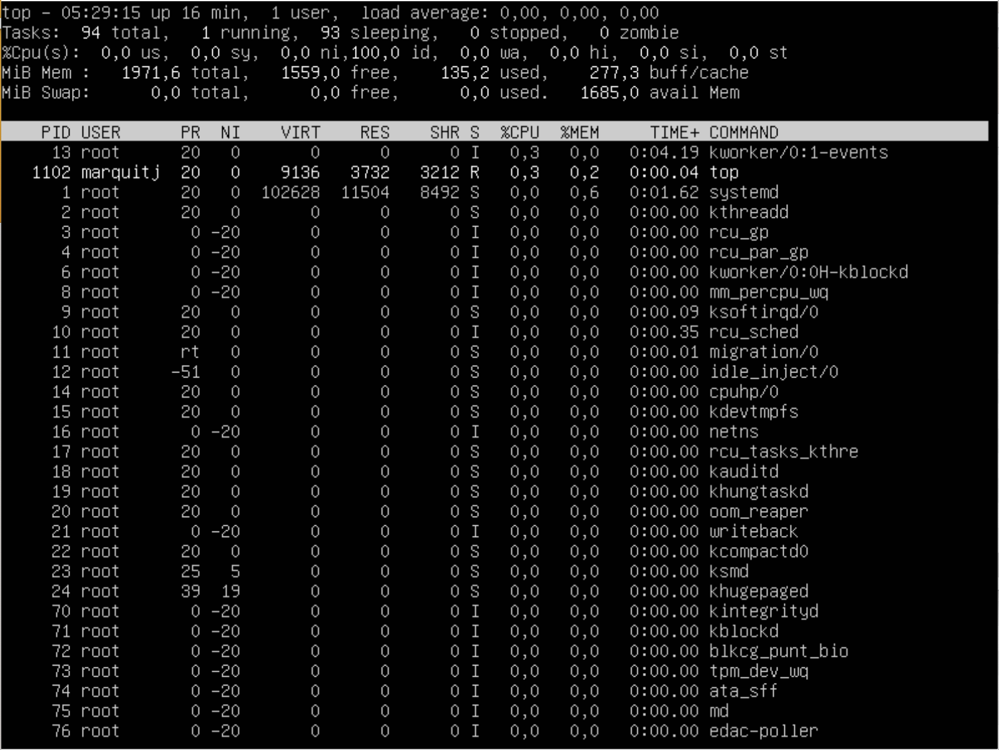

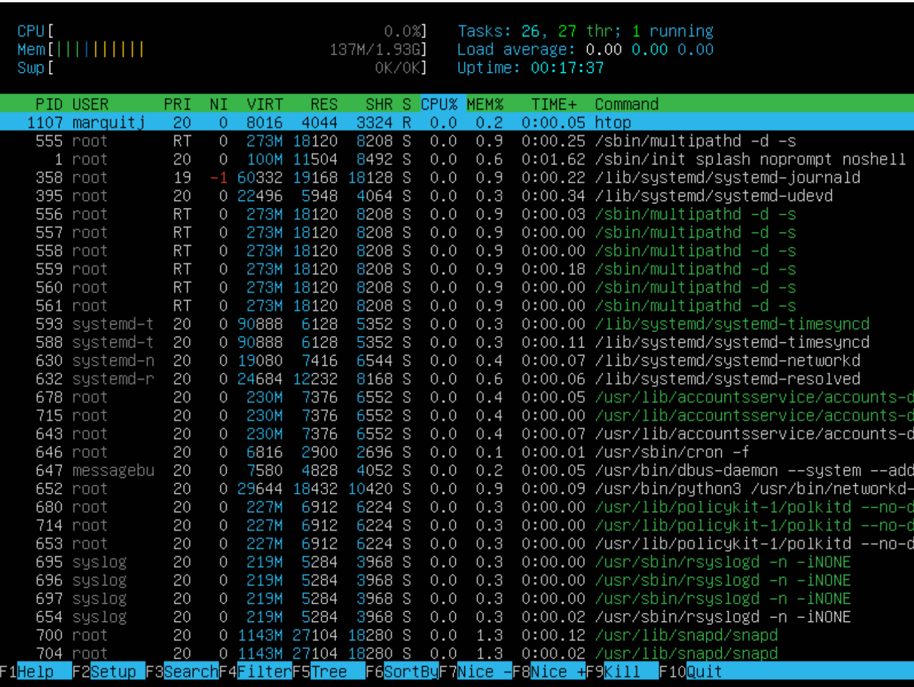

- По выводу команды top определи и напиши в отчёте:

  - uptime:
    - 05:29:15 работает 15 min;
  - количество авторизованных пользователей:
    - 1 пользователь;
  - общую загрузку системы
    - Средняя загрузка системы очень низкая (0.00, 0.00, 0.00 за последние 1, 5 и 15 минут соответственно).
  - общее количество процессов
    - в системе 94 процесса, 1 выполняется, 93 спят, 0 зомби;
  - загрузку cpu
    - процентное использование CPU разбито на пользовательское (us), системное (sy), низкоприоритетное (ni), простоя (id), ожидания ввода-вывода (wa), обработки прерываний аппаратного (hi) и программного (si) уровней.
  - загрузку памяти
    - 1971,6 Кб 1559,0 Кб свободно, 135,2 Кб используется, 277,3 Кб буфере//кэше 
  - pid процесса занимающего больше всего памяти
    - 0,2 marquitj
  - pid процесса, занимающего больше всего процессорного времени
    - 0,3 marquitj
- В отчёт вставь скрин с выводом команды htop:
  - отсортированному по PID:
  
  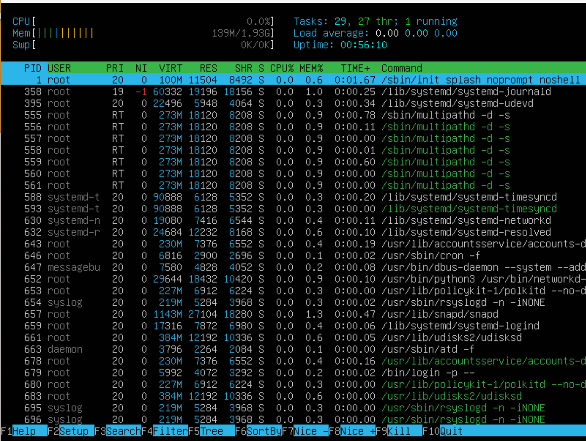
   PERCENT_CPU:
   
  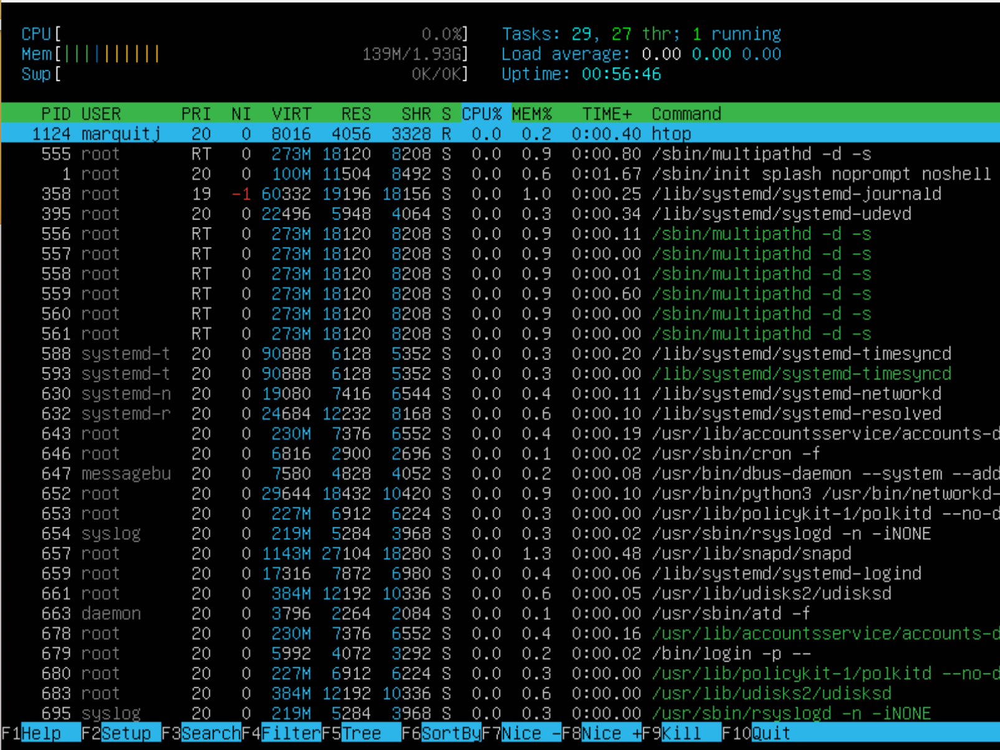
   
    PERCENT_MEM: 
    
  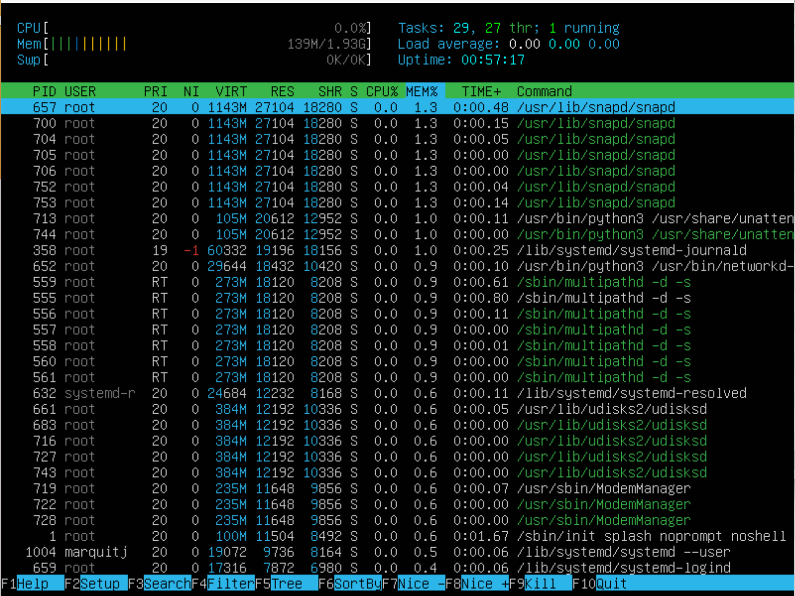
    
    TIME:

  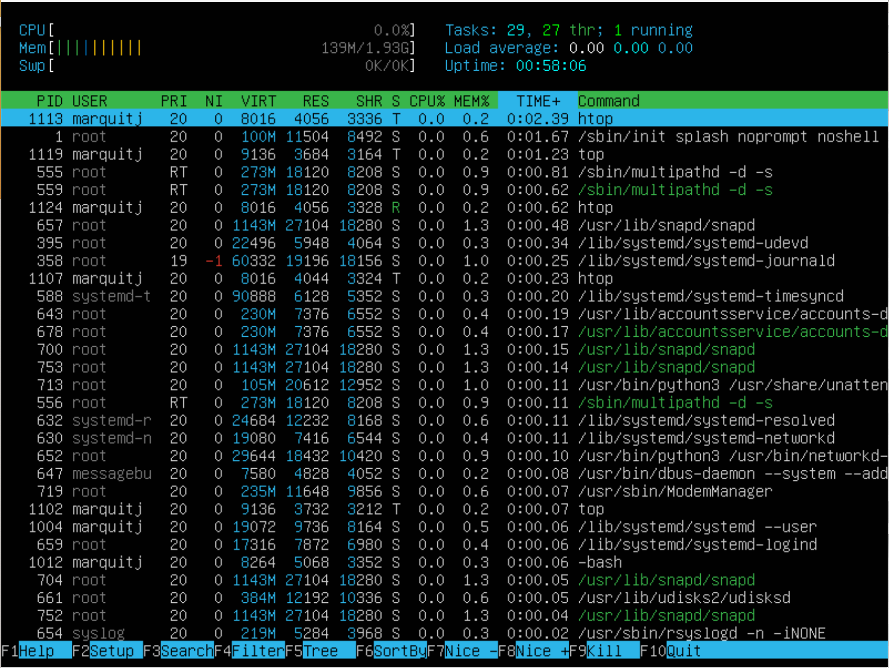

  - отфильтрованному для процесса sshd:

  

  Для просмотра нажимаем F4 вводим sshd

  - с процессом syslog, найденным, используя поиск 

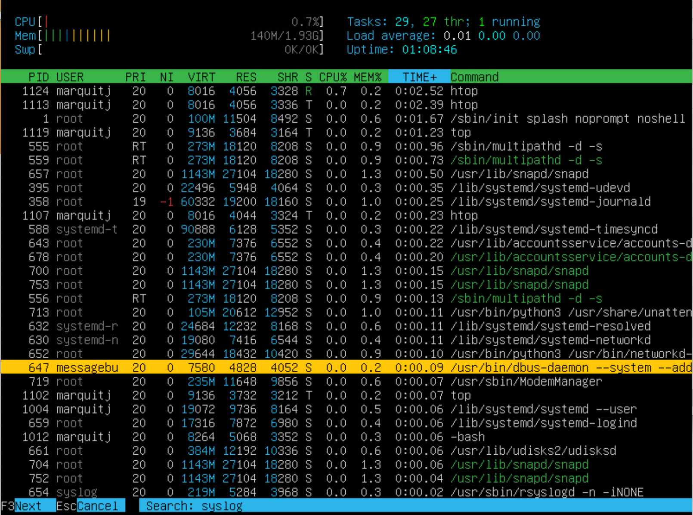
  
  - с добавленным выводом hostname, clock и uptime  

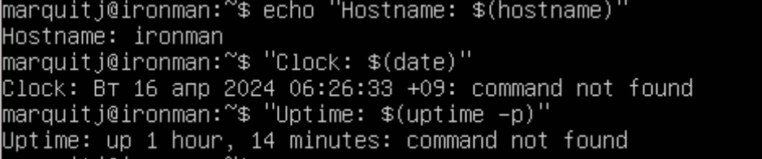

## Part 10. Использование утилиты **fdisk**

**== Задание ==**

##### Запусти команду fdisk -l.

- В отчёте напиши название жесткого диска, его размер и количество секторов, а также размер swap.

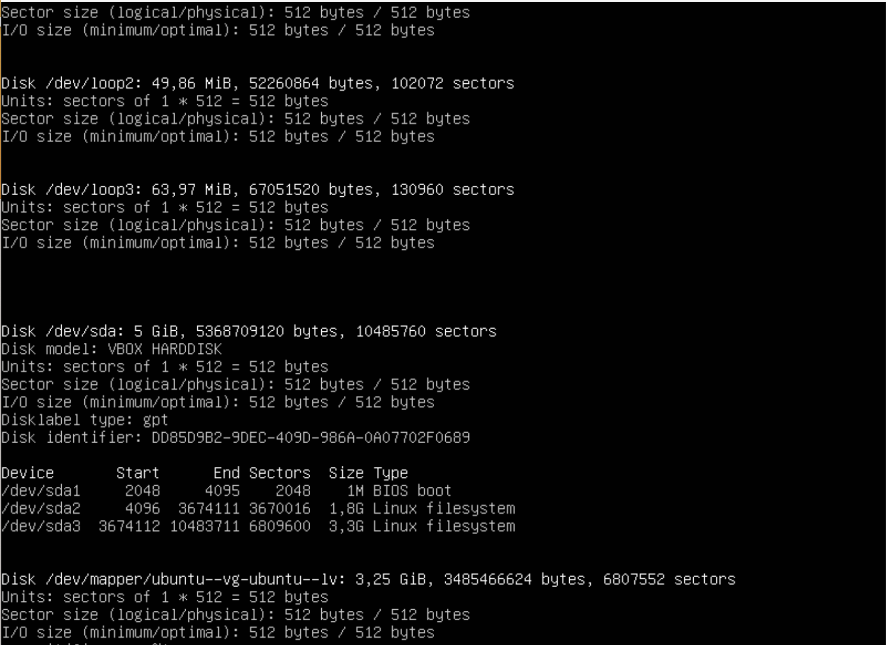

  - Название жесткого диска:
    - /dev/sda;
  - Размер жесткого диска:
    - 5368709120 bytes;
  - Количество секторов:
    - 10485760;
  - Размер swap:
    - отсутствует.

## Part 11. Использование утилиты **df** 

**== Задание ==**

##### Запусти команду df.  
- В отчёте напиши для корневого раздела (/):

  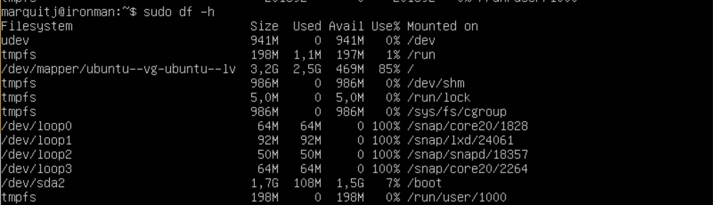

  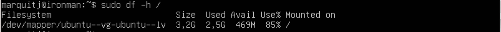

  - размер раздела:
    - 3,2 G
  - размер занятого пространства
    - 2,5 G
  - размер свободного пространства
    - 469 M
  - процент использования
    - 85%
 

##### Запусти команду df -Th.
- В отчёте напиши для корневого раздела (/):

  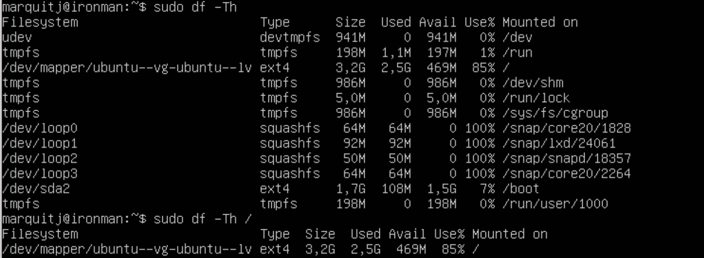
    - размер раздела:
    - 3,2 G
  - размер занятого пространства
    - 2,5 G
  - размер свободного пространства
    - 469 M
  - процент использования
    - 85%

## Part 12. Использование утилиты **du**

`-` df - не единственный способ получить информацию о дисковом пространстве. Сейчас расскажу про ещё один.

**== Задание ==**

##### Запусти команду du

  
##### Выведи размер папок /home, /var, /var/log (в байтах, в человекочитаемом виде)
    -/home:
  

    -/var:
  
    -/var/log:
  
  
##### Выведи размер всего содержимого в /var/log (не общее, а каждого вложенного элемента, используя *)

  - Используем команду **du -h /var/log/***

  

## Part 13. Установка и использование утилиты **ncdu**

**== Задание ==**

##### Установи утилиту ncdu
  - Устанавливаем с помощью команды **sudo apt-get update** затем **sudo apt-get install ncdu**

##### Выведи размер папок /home, /var, /var/log
  - /home:

    - 

  - /var:

    - 

  - /var/log:

    - 

## Part 14. Работа с системными журналами

**== Задание ==**

##### Открой для просмотра:
##### 1. /var/log/dmesg

  - 

##### 2. /var/log/syslog

  - 

##### 3. /var/log/auth.log  

  - 

- Напиши в отчёте время последней успешной авторизации, имя пользователя и метод входа в систему;

  - 

- Перезапусти службу SSHd;
  - Используется команда **sudo systemctl restart sshd** для перезапуска службы sshd, затем необходимо открыть журнал с помощбю команды **sudo grep -i 'restarting' /var/log/syslog**

    - 

## Part 15. Использование планировщика заданий **CRON**

**== Задание ==**

##### Используя планировщик заданий, запусти команду uptime через каждые 2 минуты.

  - Пишем данную команду **export EDITOR=nano** для того  чтобы редактирование cron происходило через nan0
  - Запускаем по cron команде **sudo crontab -u marquitj -e** и вписываем туда строку ***/2 * * * * /usr/bin/uptime >> /path/to/log/file.log**

- 

- Найди в системных журналах строчки (минимум две в заданном временном диапазоне) о выполнении;
- 

- 

  -Открываем данный журнал с помощью команды **journalctl -u cron.service**

##### Удали все задания из планировщика заданий.
- 

💡 [Нажми сюда](https://forms.yandex.ru/cloud/641817c002848f26a078c4a6/), **чтобы поделиться с нами обратной связью на этот проек**т. Это анонимно и поможет команде Продукта сделать твоё обучение лучше.
